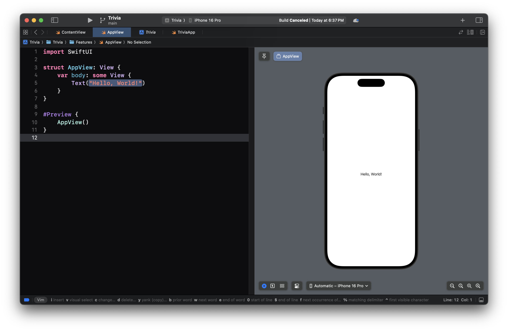
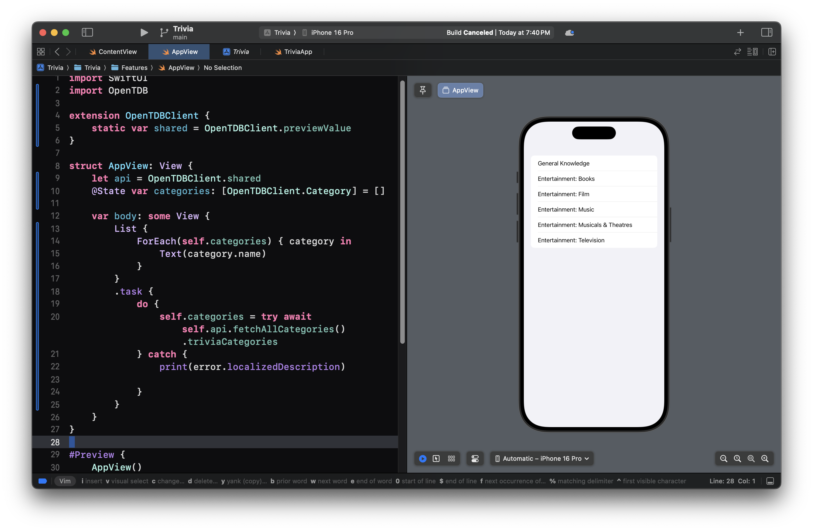

# 4. Fetching categories from the Api

The first feature that we need for our app is the ability to fetch a list of categories from the open trivia API. 



## 1. Importing OpenTDB

Let's start by importing OpenTDB. This is how we will get access to all of the functions and classes within this package.

```swift
import SwiftUI
import OpenTDB
```

## 2. Creating a shared OpenTDBClient

The actual object that fetches data is called `OpenTDBClient`. Let's create a static shared value so that it can be used throughout the app. 

```swift
extension OpenTDBClient {
    static var shared = OpenTDBClient.previewValue
}
```

We can also add a type alias to make it easier to read throughout the app.

```swift
typealias Trivia = OpenTDBClient

extension Trivia {
    static var shared = OpenTDBClient.previewValue
}
```

## 3. AppView

Now that we have a shared static value, we can add the api property to our app view, and a state property to track changes to the categories we're trying to fetch from the api.

```swift
struct AppView: View {
    let api = Trivia.shared
    @State var categories: [Trivia.Category] = []
    
    var body: some View {
        Text(...)
    }
}
```

## 4. Task Modifier

The `.task` modifier allow us to perform some asynchronous logic before the view appears. In this case fetching the categories from the API. If the function does not throw an error, we will update our state when it completes.

```swift
struct AppView: View {
    let api = OpenTDBClient.shared
    @State var categories: [OpenTDBClient.Category] = []
    
    var body: some View {
        Text("Hello, World!")
            .task {
                do {
                    self.categories = try await self.api
                      .fetchAllCategories()
                      .triviaCategories
                } catch {
                    print(error.localizedDescription)
                }
            }
    }
}
```

## 5. List View

Now that we've actually received the values, we can put them into a `List` view, and interate over them with a `ForEach` view.



```swift
struct AppView: View {
    let api = OpenTDBClient.shared
    @State var categories: [OpenTDBClient.Category] = []
    
    var body: some View {
        List {
            ForEach(self.categories) { category in
                Text(category.name)
            }
        }
        .task { ... }
    }
}
```