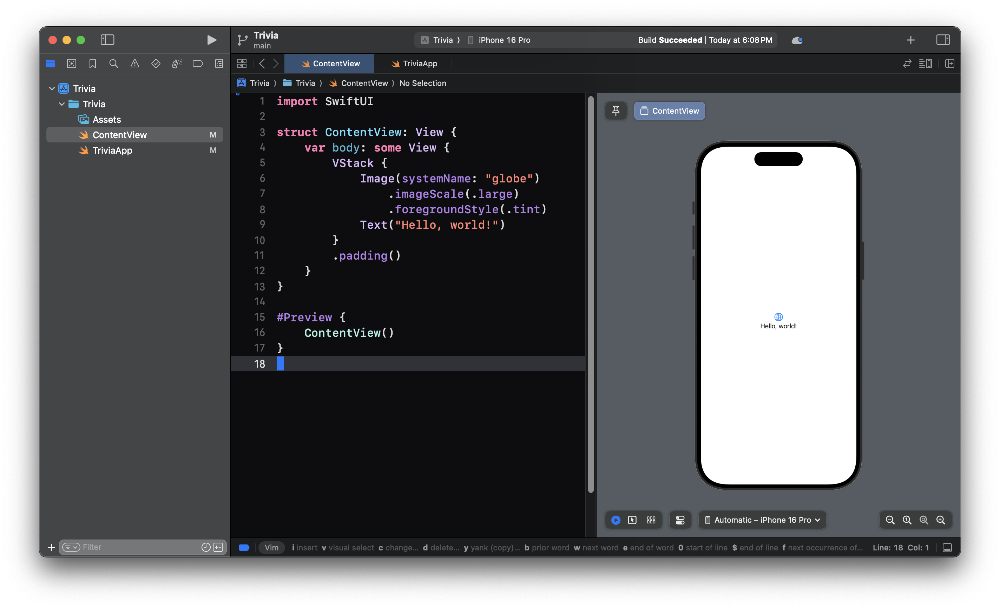
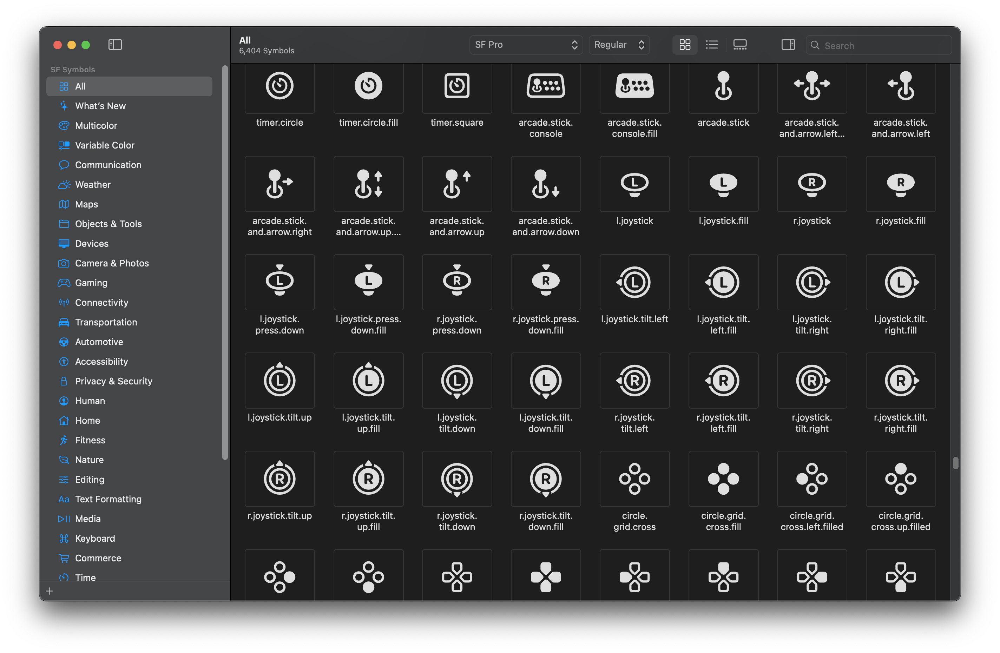
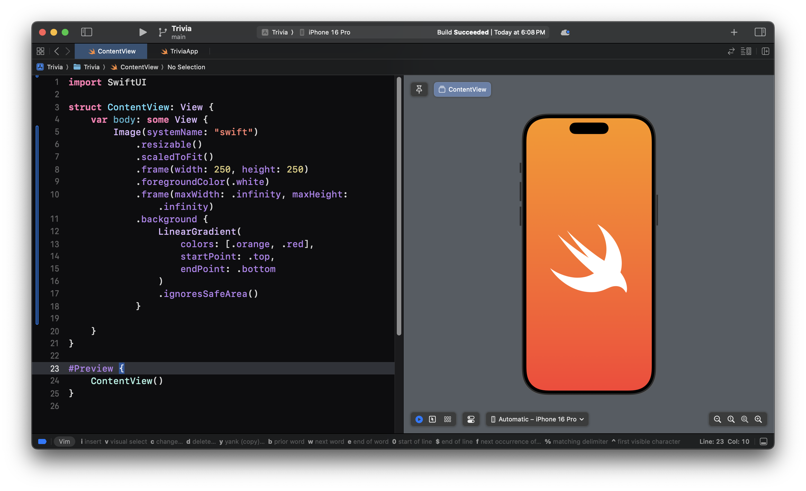
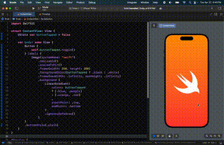

# 2. Hello SwiftUI

Now that we have the project set up, we can start building something. Let's build something small first to get our pallet ready. 



## SF Symbols

We can use [SF Symbols](https://developer.apple.com/sf-symbols/) to find a bunch of icons for us to use in our app. All of these icons integrate beautifully with SwiftUI.



## Styling the View

We can use a variety of SwiftUI [view modifiers](https://developer.apple.com/documentation/swiftui/viewmodifier) to style our image containing the swift SF symbol icon.



```swift
Image(systemName: "swift")
    .resizable()
    .scaledToFit()
    .frame(width: 250, height: 250)
    .foregroundColor(.white)
    .frame(maxWidth: .infinity, maxHeight: .infinity)
    .background {
        LinearGradient(
            colors: [.orange, .red],
            startPoint: .top,
            endPoint: .bottom
        )
        .ignoresSafeArea()
    }

```

## Interactivity

Let's add some interactivity to our view--when we tap the image, let's make it change color.

### @State

The simplest way to add state to our view is with the state property wrapper.

```swift
struct ContentView: View {
    @State var buttonTapped = false // 👈 @State
    
    var body: some View {
        Image(...)
    }
}
```

### Button

Next, we can wrap our image inside of a button to toggle the value.

The button takes two arguments: 
1. Action - function to be performed when the button is tapped
2. Label - function returning a view that the button will render 

```swift
struct ContentView: View {
    @State var buttonTapped = false
    
    var body: some View {
        Button {
          self.buttonTapped.toggle()  // 1. Action
        } label: {
          Image(...) // 2. Label
        }
    }
}
```

### Ternary Operator

There are two places where  the image needs to be updated based off of the state. The **foreground color** and the **gradient colors**.

```swift
Image(systemName: "swift")
    .foregroundColor(.white)
    .background {
        LinearGradient(
            colors: [.orange, .red],
            ...
        )
    }
```

Instead of using an if else statement, it's common practice and preferred and swift to use the **ternary operator** to compute which color you want to use and provide that directly in the view.


```swift
Image(systemName: "swift")
    .foregroundColor(buttonTapped ? .black : .white)
    .background {
        LinearGradient(
            colors: buttonTapped 
            ? [.blue, .purple] 
            : [.orange, .red],
            ...
        )
    }
```

## Finished!

With the product finished, you can now click on the image to switch colors back-and-forth. If you add the button view modifier `.buttonStyle(.plain)` it will clean up the animation a little bit.



```swift
struct ContentView: View {
    @State var buttonTapped = false
    
    var body: some View {
        Button {
            self.buttonTapped.toggle()
        } label: {
            Image(systemName: "swift")
                .resizable()
                .scaledToFit()
                .frame(width: 250, height: 250)
                .foregroundColor(buttonTapped ? .black : .white)
                .frame(maxWidth: .infinity, maxHeight: .infinity)
                .background {
                    LinearGradient(
                        colors: buttonTapped
                        ? [.blue, .purple]
                        : [.orange, .red]
                        ,
                        startPoint: .top,
                        endPoint: .bottom
                    )
                    .ignoresSafeArea()
                }
        }
        .buttonStyle(.plain)
    }
}
```

## Finished!

Keep going!