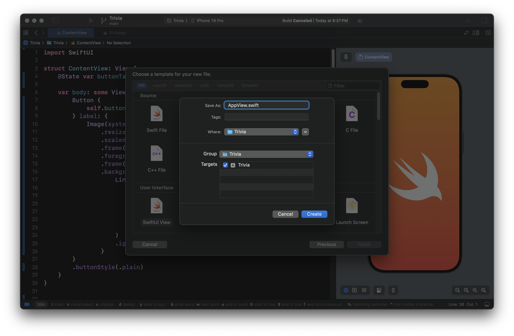
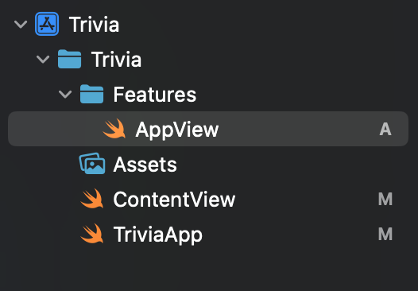
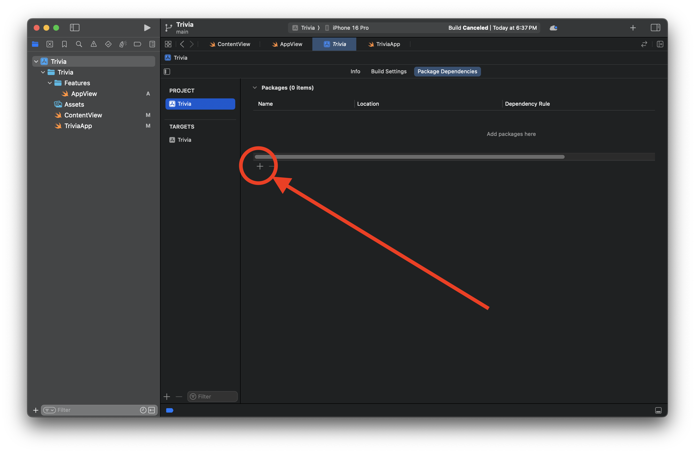
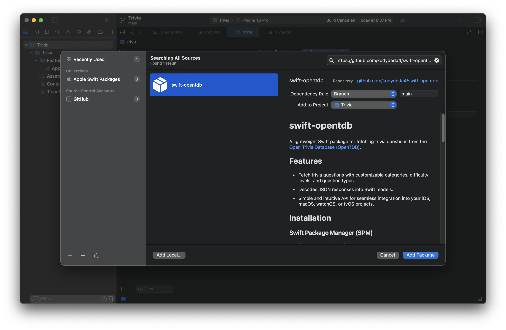
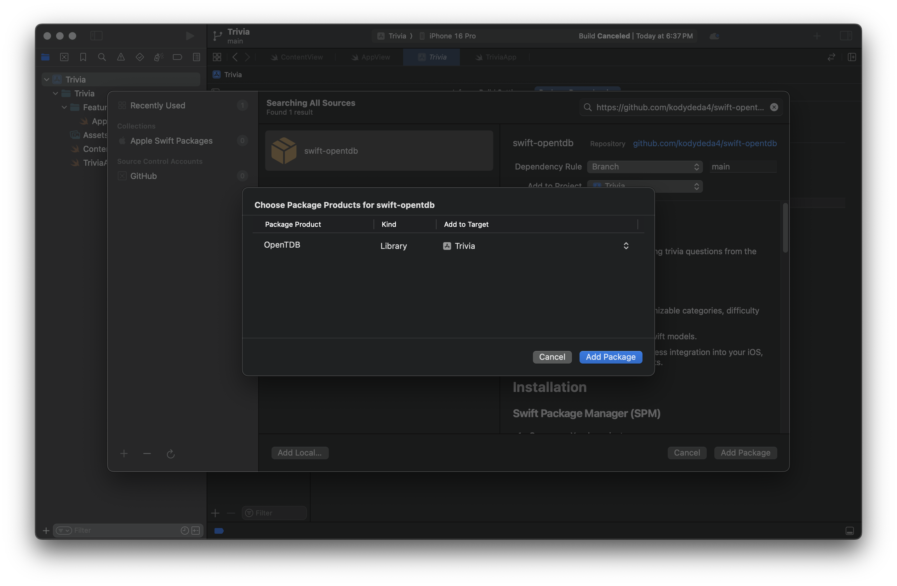

# 3. Project Setup

Now that we're done with a little demo, we can  start setting up the file structure for the real app. 

## 1. AppView

1. Create a new file with `cmd+n`. 
2. Name it `AppView.swift`.



## 2. TriviaApp

Update `TriviaApp.swift` to use AppView as the initial view for the app.

```swift
import SwiftUI

@main
struct TriviaApp: App {
    var body: some Scene {
        WindowGroup {
            AppView() // 👈 AppView
        }
    }
}
```

## 3. Folder Structure

Create a folder called Features, and place the app for you in there.



## 4. swift-opentdb

Finally, import the [swift-opentdb](https://github.com/kodydeda4/swift-opentdb) package thru swift-package-manager so that we can start building features that connect to the api.

```
https://github.com/kodydeda4/swift-opentdb
```





## Finished!

Now that we've had a basic introduction to SwiftUI, have our folder structure set up, and the dependencies loaded, we're ready to rock.