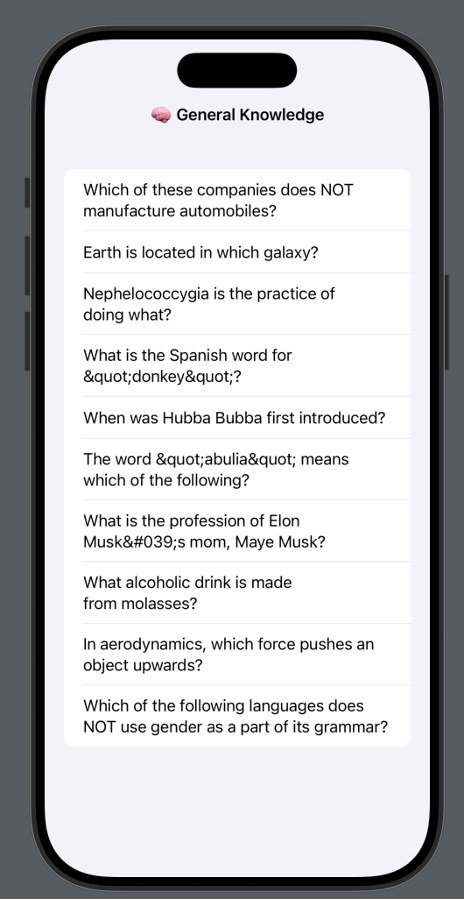

# 5. Fetching category trivia from the Api

Right now, we’re constructing the quiz destination directly inside the NavigationLink in AppView. But since we’ll eventually want to build out a more complex view for each trivia category, the best approach is to create a separate view called QuizView. This will give us a dedicated screen for the quiz and allow us to take advantage of SwiftUI previews to iterate more easily.

## 1. QuizView

### Create the View

Create a new view using `cmd+n` as we did before, name it `QuizView`.

```swift
import SwiftUI

struct QuizView: View {
    var body: some View {
        Text("Hello World")
    }
}
```

### Add the Category

Add a constant for the `Trivia.Category` so we can pass it in.

```swift
import SwiftUI
import OpenTDB 

struct QuizView: View {
    let category: Trivia.Category
    
    var body: some View {
        Text("Quiz for \(category.name)")
    }
}
```

### Fix SwiftUI Previews

The file won't compile until you pass in a category into the SwiftUI preview. Luckily, the library ships with a preview value that you can use.

```swift
#Preview {
    QuizView(category: Trivia.Category.previewValue)
}
```

### Update NavigationLink

Lastly, let's go back and update the link in the AppView to take us to the new page.

```swift
// AppView.swift

NavigationLink(
    destination: {
        //Text("Quiz for \(category.name)")
        QuizView(category: category)
    },
    label: {
        HStack {
            Text(category.name)
            Text(category.emoji)
        }
    }
)
```

## 2. Fetching the Questions

Just like in AppView, we’ll need access to the API singleton in QuizView to fetch data for the selected category. We’ll also define a @State property to store the fetched questions, use a List with a ForEach to display them, and attach a .task modifier to trigger the fetch when the view appears.

Additionally, we can set a navigation title for the view and apply the .inline display mode to keep it compact.

Finally, we’ll wrap the preview in a NavigationStack, since the actual app embeds AppView in a navigation stack—this helps keep the preview environment accurate.

Altogether, it looks like this:



```swift
import SwiftUI
import OpenTDB

struct QuizView: View {
    let api = Trivia.shared
    let category: Trivia.Category
    @State var questions: [Trivia.Question] = []
    
    var body: some View {
        List {
            ForEach(self.questions) { question in
                Text(question.question)
            }
        }
        .navigationTitle("\(category.emoji) \(category.name)")
        .navigationBarTitleDisplayMode(.inline)
        .task {
            do {
                self.questions = try await self.api.fetchQuestions(categoryId: self.category.id).results
            } catch {
                print(error.localizedDescription)
            }
        }
    }
}

#Preview {
    NavigationStack {
        QuizView(category: Trivia.Category.previewValue)
    }
}
```

## 🎉 Finished!## Finished!

In the next section, we will start building the user interaction for the quiz.