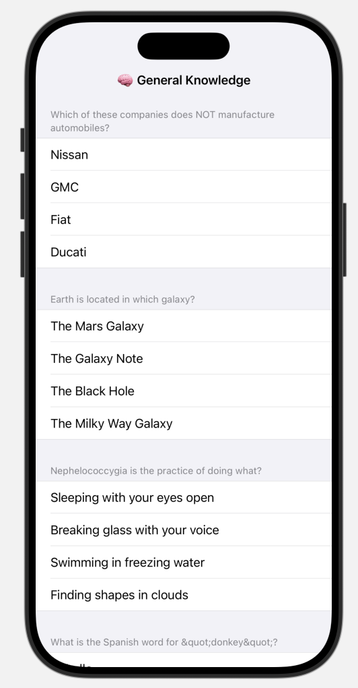
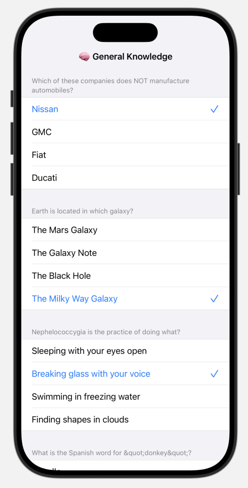

# 6. User Input for the Quiz

Now that we've fetched the quiz questions, we need to display the possible answers and let the user select one.

## Displaying the answers


We create a `Section` for each quiz question and use `ForEach` to iterate over its possible answers.

Inside each section, we display each answer as a `Text` row. Later, we can update these rows to be tappable and reflect the user's selection.

Finally, we can add `.listStyle(.grouped)` to the list to give a cleaner appearance.


```swift
List {
    // 1. for each question, create a section. 
    ForEach(self.questions) { question in
        Section {
            // 2. for each question answer, create a row.
            ForEach(question.answers, id: \.self) { answer in
                Text(answer)
            }
        } header: {
            Text(question.question)
                .textCase(.none)
        }
    }
}
```



## Handling User Input

To keep track of the user's selections, we'll store the answers in a dictionary where:
- The **key** is the question ID
- The **value** is the selected answer

This structure makes it easy to update and access each user's choice as they progress through the quiz.

```swift
@State var answers: [Trivia.Question.ID: String] = [:]

//  Example:
//
//  answers = [
//    "What's the capital of Oklahoma?": "Oklahoma City"
//    "What's the official bird of North Carolina?": "Cardinal"
//  ]
```

Next, we’ll add a button around each answer to let the user select it. When tapped, the button will update our answers dictionary with the selected value.

We can also display a checkmark image next to the selected answer to give clear visual feedback. Additionally, we can change the color of the button based on whether or not it’s selected, making the UI more intuitive and interactive.

```swift
ForEach(question.answers, id: \.self) { answer in
    Button {
        self.answers[question.id] = answer
    } label: {
        HStack {
            Text(answer)
            Spacer()
            if self.answers[question.id] == answer {
                Image(systemName: "checkmark")
            }
        }
    }
    .foregroundColor(
        self.answers[question.id] == answer
        ? .accentColor
        : .primary
    )
}
```



## Improving Code Readability

Finally, we can extract the answer row into a separate view or function to make the code easier to read and maintain. This helps keep the `List` body clean and improves reusability.

```swift
ForEach(question.answers, id: \.self) { answer in
    self.answerView(question, answer)
}
```
```swift
private func answerView(
    _ question: Trivia.Question,
    _ answer: String
) -> some View {
    
    // Declarative Code
    let isSelected = self.answers[question.id] == answer
    
    return Button {
        self.answers[question.id] = answer
    } label: {
        HStack {
            Text(answer)
            Spacer()
            if isSelected {
                Image(systemName: "checkmark")
            }
        }
    }
    .foregroundColor(isSelected ? .accentColor : .primary)
}
```

### 🎉 Finished!

In the next section, we will start building the results page.
