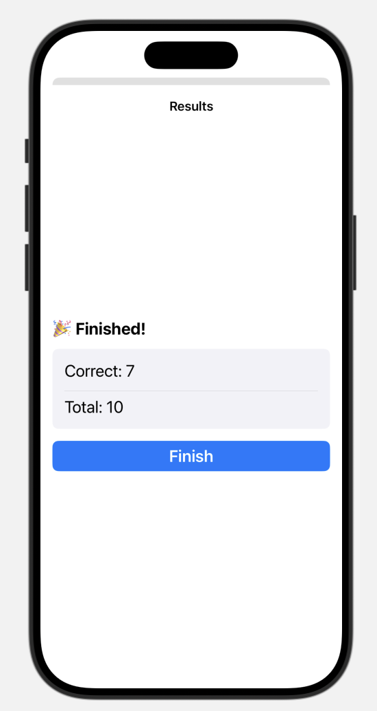

# 7. Results for the Quiz

Now that we've figured out how to store the user's selections, we can show a results sheet at the end of the quiz.

When the sheet appears, it will display the user's performance. Tapping a finish button will dismiss the sheet and navigate all the way back to the homepage.

## Modal Presentations - Sheets

You can display as sheet with SwiftUI using the `.sheet` modifier.

Let's add a "Finish" button to the QuizView toolbar that displays a sheet when tapped. Here's the important bits:


```swift
struct QuizView: View {
    ...
    @State var sheet = false // 1. State
    
    var body: some View {
        List {
            ...
        }
        .toolbar { // 2. Toolbar
            Button("Finish") {
                self.sheet = true
            }
        }
        .sheet(isPresented: $sheet) { // 3. View Modifier
            Text("Sheet") // 4. Content
        }
    }
}
```

## Creating the Results page

Similar to the previous two views—AppView and QuizView—we’re going to create our own `ResultsSheet` view to handle the quiz results, so that we can display the results and handle the logic on a single page.

Modal presentations like [sheets](https://developer.apple.com/documentation/swiftui/view/sheet(ispresented:ondismiss:content:)) and [full screen covers](https://developer.apple.com/documentation/swiftui/view/fullscreencover(ispresented:ondismiss:content:)) come with their own navigation stacks, separate from the main view hierarchy.

We can also update the preview to always show our view as a sheet, which helps us design and test the layout in the correct context.


```swift
import SwiftUI

struct ResultsSheet: View {
    var body: some View {
        NavigationStack {
            Text("Results")
                .navigationTitle("Results")
                .navigationBarTitleDisplayMode(.inline)
        }
    }
}

#Preview {
    Text("Hello World").sheet(isPresented: .constant(true)) {
        ResultsSheet()
    }
}
```

!

## Passing in the data

The results page needs access to both the quiz questions and the user's selected answers in order to render the final results.

We’ll pass these in as constants when creating the `ResultsSheet` view. For the preview, we can use the sample questions and answers included in the package to provide realistic data and test the layout using `.previewValue`.

```swift
struct ResultsSheet: View {
    let questions: [Trivia.Question]
    let answers: [Trivia.Question.ID: String]

    var body: some View {
        NavigationStack {
            Text("Results")
                .navigationTitle("Results")
                .navigationBarTitleDisplayMode(.inline)
        }
    }
}

#Preview {
    Text("Hello World").sheet(isPresented: .constant(true)) {
        ResultsSheet(
            questions: .previewValue,
            answers: .previewValue
        )
    }
}
```

Finally, let's make sure we're passing in the real data in the QuizView:

```swift
// QuizView.swift

.sheet(isPresented: $sheet) {
    ResultsSheet(
        questions: self.questions,
        answers: self.answers
    )
}
```

## Displaying the data

Since we have access to both the questions and the user’s answers in the results screen, we can derive how many answers were correct out of the total.

We can then display this as a summary at the top of the UI to give the user a clear overview of their performance.

### Derriving the Correct Count:

#### The Python way

If you're used to Python, you might derive the value like this:

```swift
var correctCount: Int {
    var count = 0
    
    for question in questions {
        if question.correctAnswer == answers[question.id] {
            count += 1
        }
    }
    
    return count
}
```

#### The Swift way

However, since we've as high order functions like [filter](https://developer.apple.com/documentation/swift/string/filter(_:)), [map](https://developer.apple.com/documentation/swift/sequence/map(_:)), and [reduce](https://developer.apple.com/documentation/swift/array/reduce(_:_:)), we can write it more declaratively.

```swift
var correctCount: Int {
    questions.filter { question in
        question.correctAnswer == answers[question.id]
    }
    .count
}
```

Now we can update the results sheet to show the results, and a button we will tap to go back to the homepage.

```swift
NavigationStack {
    VStack(alignment: .leading) {
        Text("🎉 Finished!").bold()
        GroupBox {
            VStack(alignment: .leading) {
                Text("Correct: \(correctCount)")
                Divider()
                Text("Total: \(questions.count)")
            }
        }
        
        Button {
            // ...
        } label: {
            Text("Finish")
                .fontWeight(.semibold)
                .frame(maxWidth: .infinity)
        }
        .buttonStyle(.borderedProminent)
        .padding(.top, 8)
    }
    .padding()
    .font(.title2)
    .navigationTitle("Results")
    .navigationBarTitleDisplayMode(.inline)
}
```



## Navigating all the way back to the home page

Let’s add logic to the “Finish” button that, when tapped, dismisses the results sheet and takes the user all the way back to the homepage.

Since we need to dismiss both the sheet and the quiz, we’ll have to pass a function in from the QuizView into the ResultsSheet to be triggered when the user taps the “Finish” button. This is called a **callback**.

Here's the important bits:

```swift
struct ResultsSheet: View {
    ...
    var finishButtonTapped: () -> Void = {}
    
    var body: some View {
        ...
        Button {
            self.finishButtonTapped()
        } label: {
            ...
        }
    }
}
```

```swift
// QuizView.swift

.sheet(isPresented: $sheet) {
    ResultsSheet(
        questions: self.questions,
        answers: self.answers,
        finishButtonTapped: {
            /// do something
        }
    )
}
```

### SwiftUI Environment

SwiftUI provides a powerful feature called the [Environment](https://developer.apple.com/documentation/swiftui/environment), which gives us access to system-level values and functions throughout the view hierarchy.

One of these is dismiss, a function we can use to programmatically close the current view. We’ll access dismiss from within the QuizView, and then pass it as a callback to the ResultsSheet. When the user taps the “Finish” button, we’ll call this function to dismiss both the results sheet and navigate back to the homepage.

```swift
struct QuizView: View {
    ...
    @State var sheet = false
    @Environment(\.dismiss) var dismiss // SwiftUI Environment
    
    var body: some View {
        List {
            ...
        }
        .sheet(...) {
            ResultsSheet(
                questions: ...,
                answers: ...,
                finishButtonTapped: {
                    // Dismiss Callback
                    self.sheet = false
                    self.dismiss()
                }
            )
        }
    }
}
```


### 🎉 Finished!

Congratulations the app is functional and works. The only thing left is to style the homepage a little bit for fun.