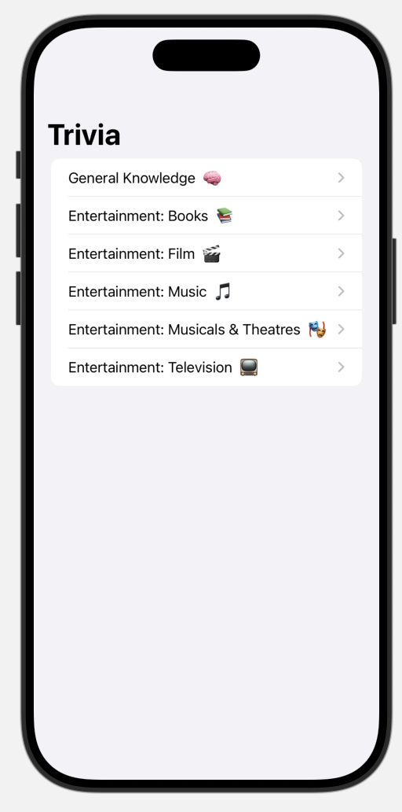
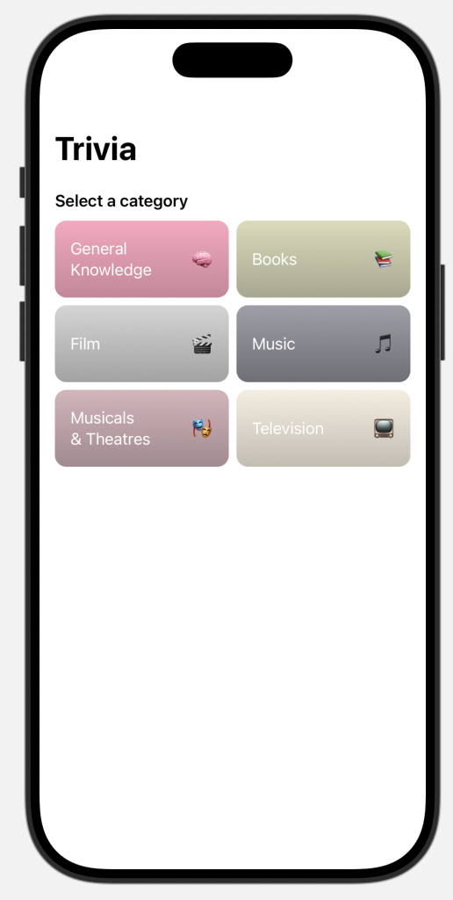
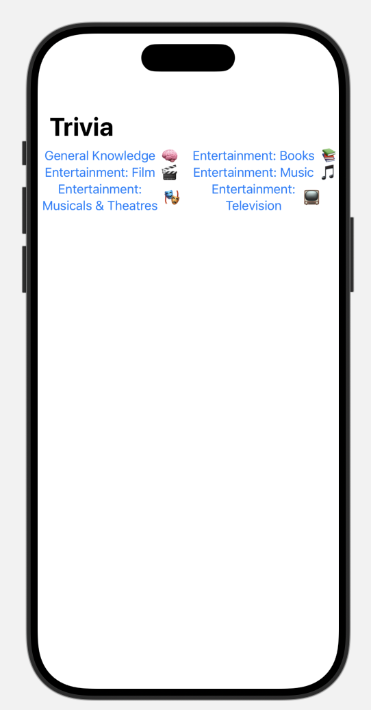
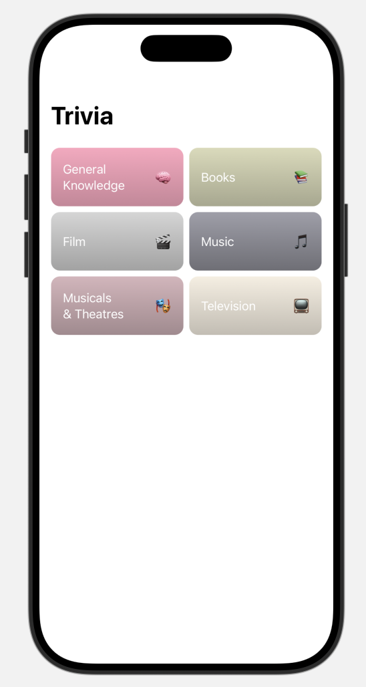
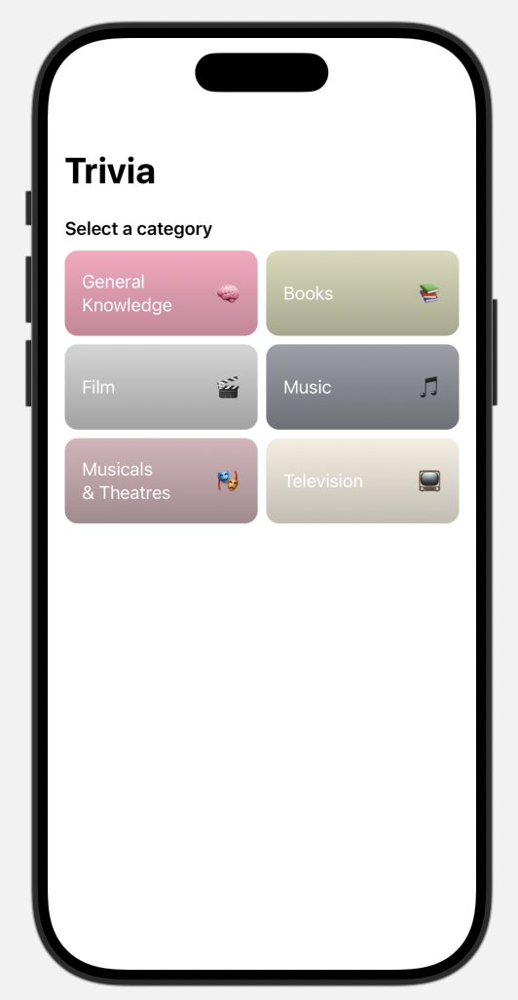
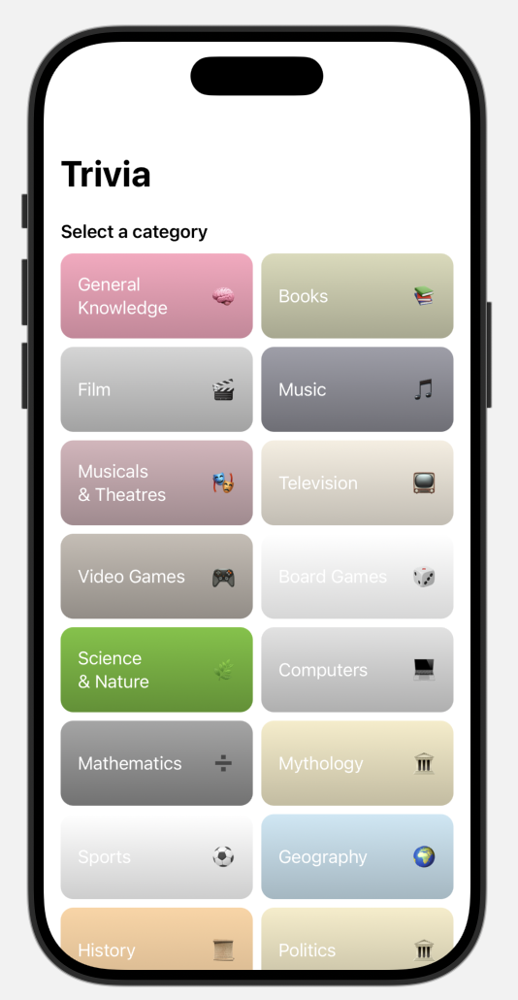

# 8. Additional Styling

The app is fully functional, the only thing I want to do is style the homepage a little bit.

Instead of using navigation link like before, we can display the categories in a grid and use buttons to navigate.




## ScrollView & LazyVGrid

Let's swap out the List for a ScrollView, and add a LazyVGrid for the categories to start.

```swift
ScrollView {
    LazyVGrid(columns: Array(
        repeating: GridItem(.flexible()),
        count: 2
    )) {
        ForEach(self.categories) { category in
            NavigationLink(
                destination: { ... },
                label: { ... }
            )
        }
    }
}
```



## Styling the Links

Now we can create a function for the label and style the view there. The library ships with a color overload that can be generated from an emoji.


```swift
private func categoryView(category: Trivia.Category) -> some View {
    HStack {
        Text(category.formattedName)
        Spacer()
        Text(category.emoji)
    }
    .foregroundColor(.white)
    .padding()
    .frame(height: 80)
    .background {
        LinearGradient(
            colors: [
                Color(emoji: category.emoji).adjustBrightness(by: 0.6),
                Color(emoji: category.emoji).adjustBrightness(by: 0.4)
            ],
            startPoint: .top,
            endPoint: .bottom
        )
    }
    .clipShape(RoundedRectangle(cornerRadius: 12, style: .circular))
}
```

Now just update the grid to use the new view.

```swift
ScrollView {
    LazyVGrid(columns: Array(
        repeating: GridItem(.flexible()),
        count: 2
    )) {
        ForEach(self.categories) { category in
            NavigationLink {
                QuizView(category: category)
            } label: {
                categoryView(category: category)
            }
            .buttonStyle(.plain)
        }
    }
    .padding()
}
```



## Finishing Touches

Finally, you can wrap the grid in a section for a little added pizzazz.

```swift
ScrollView {
    VStack(alignment: .leading) {
        Section(header: Text("Select a category").font(.headline)) {
            LazyVGrid(columns: Array(
                repeating: GridItem(.flexible()),
                count: 2
            )) {
                ForEach(self.categories) { category in
                    NavigationLink {
                        QuizView(category: category)
                    } label: {
                        categoryView(category: category)
                    }
                    .buttonStyle(.plain)
                }
            }
        }
    }
    .padding()
}
```




## Switching from Mock Data to the Real API

Suprise! You’ve actually been using a version of the API that returns mock data this entire time—it doesn’t even reach out to the OpenTDB server. This was done intentionally to help you build the UI without needing a network connection.

Now that your app is ready, you can switch from the preview version of the API to the live version by going back to the shared singleton. This change will let you fetch real questions from the OpenTDB server.

This approach is part of a common pattern called dependency injection—where we “inject” different versions of a dependency (like an API client) into our views or logic, depending on whether we’re in development, testing, or production.

```swift
extension OpenTDBClient {
//    static var shared = OpenTDBClient.previewValue
    static var shared = OpenTDBClient.liveValue
}
```



## 🎉 Finished!

The app is finished and the workshop is complete!

Be sure to check the root README file for additional resources to continue your iOS development journey.

Thanks for joining in—hope you had fun and learned something new!
