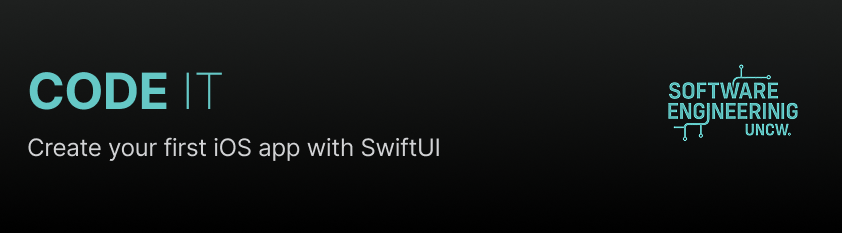

# UNCW iOS Developer Workshop

## Overview

Today we’re creating a trivia app for iOS, powered by [SwiftUI](https://developer.apple.com/xcode/swiftui/) and the [Open Trivia Database](https://opentdb.com). We’ll fetch trivia data in JSON format and use it to build our app.

This workshop is going to use the following tools:

* [SwiftUI](https://developer.apple.com/xcode/swiftui/) - Apple's declarative UI Framework  
* [Open Trivia Database](https://opentdb.com) - a free, community-contributed collection of trivia questions.  
* [swift-opentdb](https://github.com/kodydeda4/swift-opentdb) Unofficial OpenTriviaDatabase package for swift

## Table of Contents

The workshop is broken down into a few essential lessons that you can use to follow along if you missed anything.

- [1. Creating the Project](01-creating-the-project.md)
- [2. SwiftUI Introduction](02-hello-swiftui.md)
- [3. Project Setup](03-project-setup.md)
- [4. Fetching Categories from the Api](04-fetching-categories-from-the-api.md)
- [5. Fetching Category Trivia from the Api](05-fetching-category-trivia-from-the-api.md)
- [6. User Input for the Quiz](06-user-input-for-thequiz.md)

## Learning Resources

Enjoyed the workshop? Here’s where you can learn even more about iOS Development:

- [Swift Getting Started](https://swift.org/getting-started/)
- [Apple Developer](https://developer.apple.com/)
- [Hacking with Swift](https://www.hackingwithswift.com/)
- [100 Days of SwiftUI](https://www.hackingwithswift.com/100/swiftui)
- [PointFree.co](https://www.pointfree.co/)
- [Reddit & Discord Communities](https://www.reddit.com/r/SwiftUI/)

